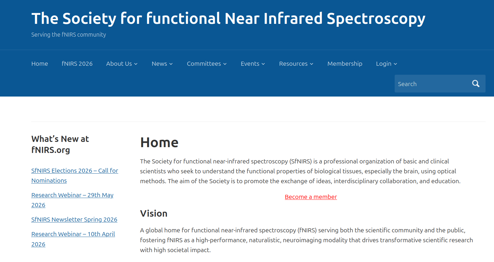
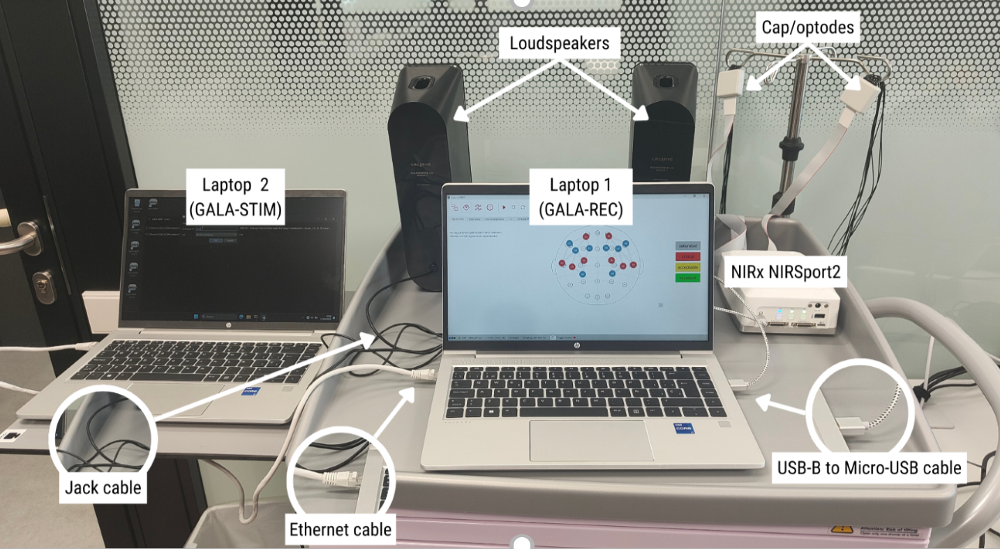
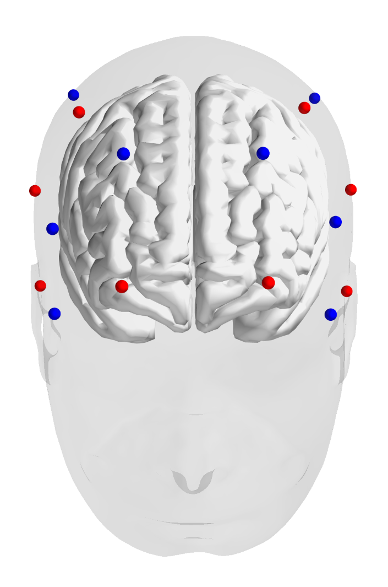
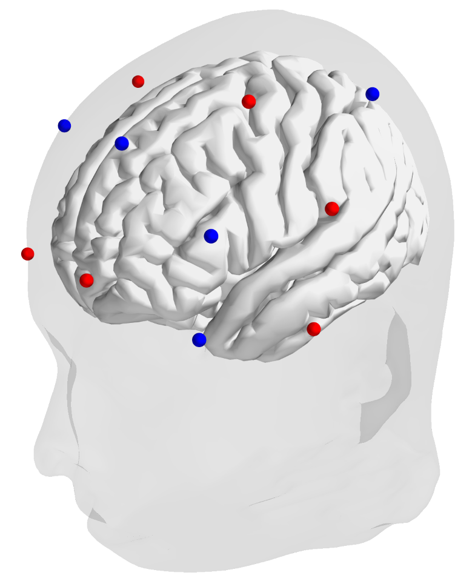
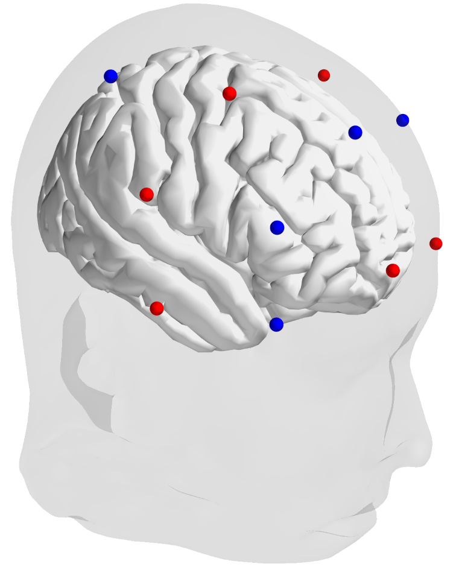
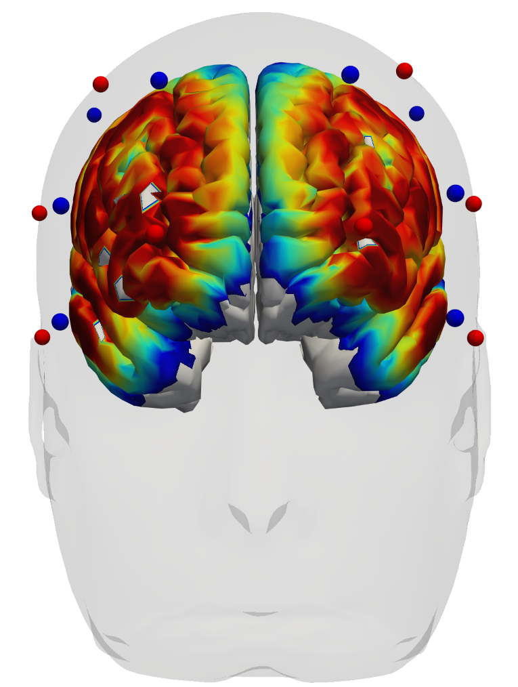
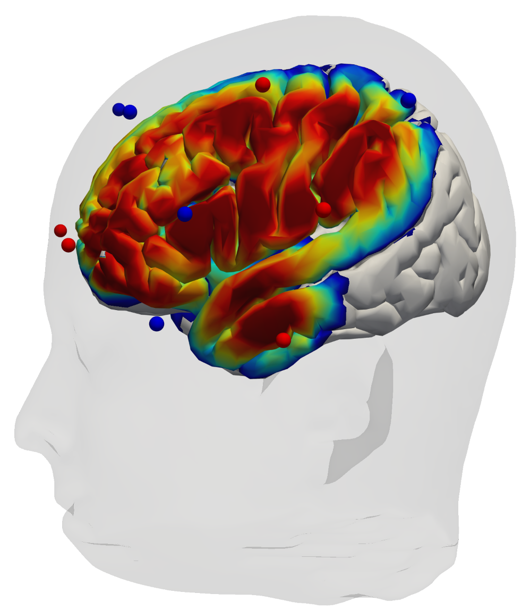
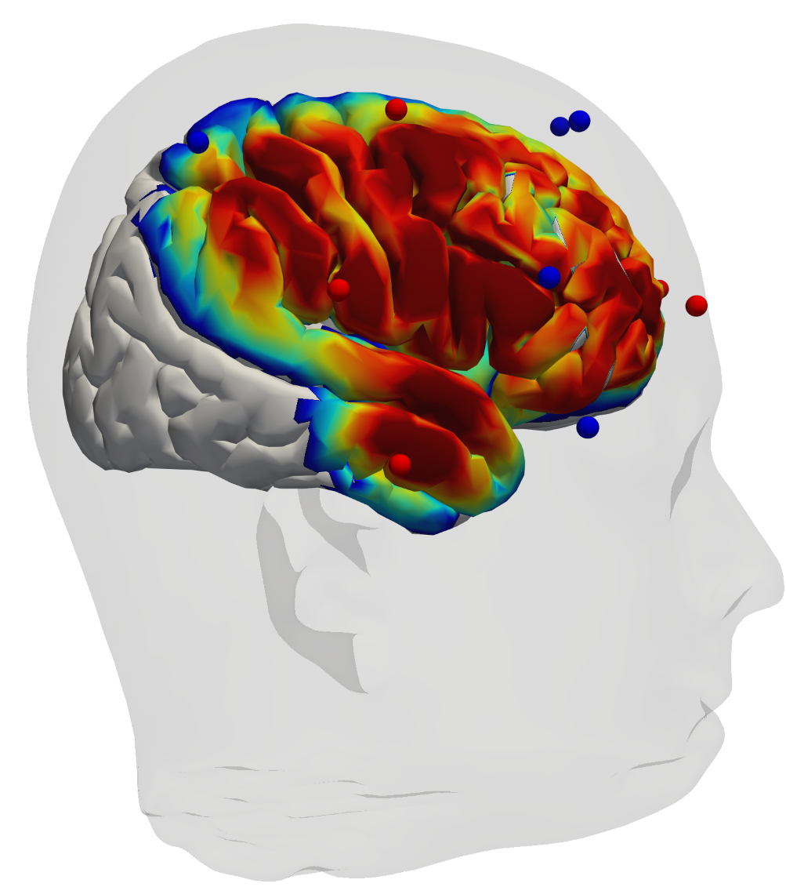
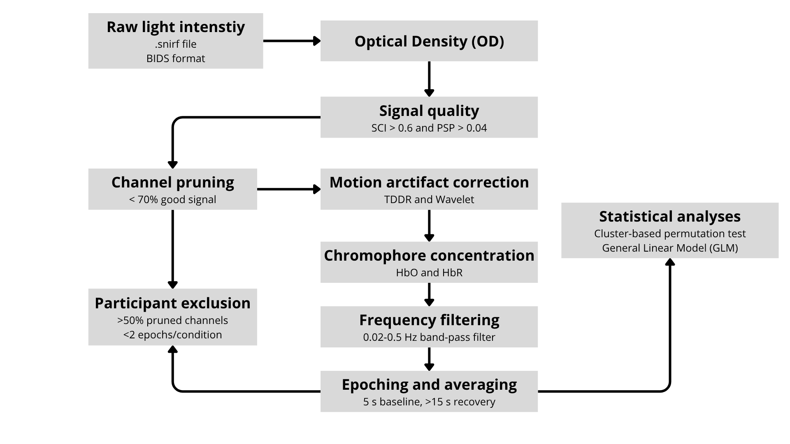
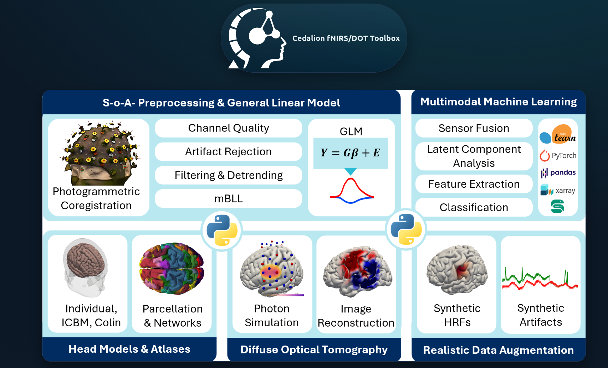

```{python}
# | label: setup
from pathlib import Path

from cedalion.dataclasses import Recording
from cedalion import io
from matplotlib import pyplot as plt
from matplotlib import colors
import numpy as np
import pandas as pd
from scipy import signal

from src import nirs

plt.rcParams["figure.autolayout"] = True

DATA_PATH: Path = Path("data")

STIM_MAPPING: dict[str, list[int]] = {
    "A": [9],
    "B": [10],
    "Exclude": [2, 4, 6, 7],
}

rec = io.read_snirf(DATA_PATH / "ssp-good.snirf")[0]
rec.stim = nirs.process_events(rec.stim, STIM_MAPPING)
rec.stim = rec.stim[rec.stim["trial_type"] != "Exclude"]
```

## About us

**NeuroDevelopment and Comparative Cognition (NeuroDevCo)**

::: {.smaller}
*HORIZON-ERC-2023-StG: GALA (Gates to Language)*
:::

{fig-align="center"}

## Functional Near-Infrared Spectroscopy


## [Functional Near-Infrared]{.lightgrey} Spectroscopy

## [Functional Near-Infrared]{.lightgrey} Spectroscopy

Some materials have **different optical properties** than others (e.g., they absorbe more light of some colors).

{fig-align="center"}

## [Functional Near-Infrared]{.lightgrey} Spectroscopy

We can study the **composition of an object** by analysing how light behaves when passing through it (i.g., **spectroscopy**)

{fig-align="center"}

## [Functional]{.lightgrey} Near-Infrared [Spectroscopy]{.lightgrey}


## [Functional]{.lightgrey} Near-Infrared [Spectroscopy]{.lightgrey}

**Oxy-haemoglobin** ([HbO]{.red}) and **deoxy-haemoglobin** ([HbR]{.blue}) absorb **near-infrared light** differently


## Functional [Near-Infrared Spectroscopy]{.lightgrey}

If we shine near-infrared light into biological tissue, we can estimate **changes in relative concentration** of [HbO]{.red} and [HbR]{.blue} time

::: {.box .center}
**modified Beer-Lambert Law (mBLL)**
:::

* Describes **changes in light absorption** of underlying tissue using continuous waves methods
* Based on a generalization of **Beer-Lambert law**
* Assumes that the scattering properties of tissue do not vary with time

## Functional [Near-Infrared Spectroscopy]{.lightgrey}

<br>
<br>

::: {.columns}
:::: {.column}
* Blood-Oxygen-Level-Dependent (**BOLD**) response
* **Surplus of [HbO]{.red}** sent to recently active brain areas
* Takes ~15 seconds recover baseline
::::

:::: {.column}
{fig-align="center"}
::::
:::

## Functional [Near-Infrared Spectroscopy]{.lightgrey}

<br>
<br>

**Canonical Haemodynamic Response Function (HRF)**

{fig-align="center"}

## Resources

**The fNIRS Glossary project** [@stute2025fnirs]

[https://openfnirs.org/standards/fnirs-glossary-project/](https://openfnirs.org/standards/fnirs-glossary-project/ )

{fig-align="center"}

## Resources

Society for Functional Near Infrared Spectroscopy ([SFNIRS](https://fnirs.org))

{fig-align="center"}

## fNIRS for experimental tasks

{fig-align="center"}

## fNIRS for experimental tasks

<br>
<br>

::: {.columns}
::: {.column}

### Advantages

* Commercially available (still pricey)
* Relatively easy capping
* Flexible and portable, robust to movement*
* Hight-density diffuse optical tomography (HD-DOT) [@culver2001optimization]
:::

::: {.column}

### Limitations

* Limited access to sub-cortical regions (~3 cm)*
* Temporal resolution constrained by haemodynamics
* Relatively pricey
* Limited spatial resolution
:::
:::

## Hardware

<br>
<br>

- [NIRx](https://nirx.net) (Germany): NIRSport2
- [Artinis](https://www.artinis.com) (The Netherlands): Brite, OxyMon
- [Hitachi](https://healthcaresolutions-us.fujifilm.com/) (Japan): ETG 4000
- [GowerLabs](https://www.gowerlabs.co.uk/) (UK): LUMO (HD-DOT system)
- [Cortivision](https://www.cortivision.com/) (Poland): Spectrum C23 fNIRS
- [PIONIRS](https://www.pionirs.com/wp/) (Italy): NIRSBOX


# fNIRS in neonates

## fNIRS at the Hospital Sant Joan de Déu

<br>
<br>

**Healthy** participants: ≥ 2,700 g & ≥ 8 Apgar-10 & ≥37 weeks post-mentrual age

Tested **6-72 hours after delivery**

**Cot-side testing** inside hospital room (Àrea de la Dona)

## fNIRS at the Hospital Sant Joan de Déu

### Setup



## fNIRS at the Hospital Sant Joan de Déu

### Setup

<br>
<br>

::: {.columns}
::: {.column width="57%"}

:::

::: {.column width="43%"}

:::
:::

## fNIRS at the Hospital Sant Joan de Déu

### Setup

{fig-align="center"}

## fNIRS at the Hospital Sant Joan de Déu

### Montage/optode layout

::: {.columns .center}
:::: {.column width="35%"}
{fig-align="center"}
::::
:::: {.column}
::::: {.columns}
:::::: {.column}
{fig-align="center"}
::::::
:::::: {.column}
{fig-align="center"}
::::::
:::::
::::
:::

## fNIRS at the Hospital Sant Joan de Déu

### Montage/optode layout

::: {.columns .center}
:::: {.column width="35%"}
{fig-align="center"}
::::
:::: {.column}
::::: {.columns}
:::::: {.column}
{fig-align="center"}
::::::
:::::: {.column}
{fig-align="center"}
::::::
:::::
::::
:::

## Challenges in neonatal fNIRS

<br>
<br>

* True **shape of the HRF is relatively unknown** and variable within/between partiicpants and studies [@cristia2013online; @lloyd2010illuminating]

## fNIRS in neonates

::: {.columns}
:::: {.column}
**Canonical response**

{fig-align="center"}
::::
:::: {.column}
::::
:::

## fNIRS in neonates


::: {.columns}
:::: {.column}
**Canonical response**

{fig-align="center"}
::::
:::: {.column}
**Inverted response**

{fig-align="center"}
::::
:::

## Challenges in neonatal fNIRS

<br>
<br>

* True **shape of the HRF is relatively unknown** and variable within/betweem partiicpants and studies [@cristia2013online; @lloyd2010illuminating]
    + Ongoing maturation of the neurovascular coupling barrier? [@issard2018variability; @arichi2012development]

::: incremental
* **Movement**, event during deep sleep
* **Wakefulness state**: ~40 min. sleep cycles
* **Head morphology**: spatial registration is challenging
* **Environment**: hospital ward
:::

## Designing a preprocessing pipeline

### The FRESH initiative

<br>
<br>

::: box
Yücel, M. A., Luke, R., Mesquita, R. C., von Lühmann, A., Mehler, D. M., Lührs, M., ... & Zemanek, V. (2025). **fNIRS reproducibility varies with data quality, analysis pipelines, and researcher experience**. *Communications biology*, 8(1), 1149.
:::

## Designing a preprocessing pipeline

### The FRESH initiative

<br>
<br>

* Asked **38 research teams** worldwide to independently analyze the same two fNIRS datasets.
* Using different pipelines, **nearly 80% of teams agreed on group-level results**
* Teams with higher self-reported analysis confidence, which correlated with years of fNIRS experience, showed greater agreement
* Main sources of variability were related to how poor-quality data were handled

## Designing a preprocessing pipeline

### The FRESH initiative

{fig-align="center"}

## Designing a preprocessing pipeline

### The FRESH initiative

{fig-align="center"}

## Designing a preprocessing pipeline

<br>
<br>

::: box
Gemignani, J., & Gervain, J. (2021). **Comparing different pre-processing routines for infant fNIRS data**. *Developmental Cognitive Neuroscience*, 48, 100943.
:::

## Designing a preprocessing pipeline

<br>
<br>

* Data **quality/inclusion trade-off**

::: incremental
* Performance of all pipelines deteriorated with increasing levels of **noise**
* Use automatic motion artifact correction with **caution**: false negatives, reduced effect sizes, underestimation of the HRF
* The **ordering** of some preprocessing steps does not impact conclusions overall
:::

## Designing a preprocessing pipeline

<br>
<br>

{fig-align="center"}


## Pipeline suggestion



## Software

<br>
<br>

- Homer2/[Homer3](https://openfnirs.org/software/homer/) [@huppert2009homer]
- [MNE-Python](https://mne.tools/stable/index.html) [@gramfort2013meg], [MNE-NIRS](https://mne.tools/mne-nirs/stable/index.html) [@luke2021analysis]
- [AnalyzIR](https://github.com/huppertt/nirs-toolbox) [@santosa2018nirs]
- [Brainstorm](https://neuroimage.usc.edu/brainstorm) [@tadel2011brainstorm], [NIRStorm](https://github.com/Nirstorm/nirstorm) [@delaire2025nirstorm] 
- [OxySoft (Artinis)](https://www.artinis.com/oxysoft)
- [NIRSTORM](https://github.com/Nirstorm/nirstorm)
- [Fieldtrip](https://www.fieldtriptoolbox.org/)
- [Cedalion](http://cedalion.tools/) [@middell2026cedalion]

## Software

[Cedalion](http://cedalion.tools/) [@middell2026cedalion]



# Participant case study

## Datasets

<br>
<br>

::: {.columns}
::: {.column}
### Neonates

García-Castro G., Sofocleous C., Gervain, J., Alarcón Allen A., and Santolin C. (in prep)
:::
::: {.column}
### Adults

Hernández-Sauret, A., García-Castro, G., & Redolar-Ripoll, E. (2026). *Brain Topography*, 39(1), 2. [https://link.springer.com/article/10.1007/s10548-025-01157-4](https://link.springer.com/article/10.1007/s10548-025-01157-4)
:::
:::

## Datasets

{fig-align="center"}

## The good: adult data

<br>

Importing raw light intensity from `.snirf` file:

<br>

```python
from pathlib import Path
from cedalion import io

rec = io.read_snirf(Path("data/adult.snirf"))[0]

print(rec)
```

<br>

* `rec["amp"]`: Raw light intensity dataset
* `rec["masks"]`: Signal quality masks
* `rec["stim"]`: Dataset of events (e.g., stimulus triggers, annotations)
* `rec["aux_ts"]`: Additional timeseries (e.g., accelerometer, heatbeat rate)

## The good: adult data
 
<br>

::: columns
:::: {.column width="75%"}
Plotting raw light intensity data with [matplotlib](https://matplotlib.org/):
::::
:::: {.column width="25%"}

::::
:::

```python
from matplotlib import pyplot as plt

amp = rec["amp"]

fig, axes = plt.subplots(2, 1)

for wl_i, wl in enumerate(amp.wavelength.values):
    for ch in amp.channel.values:
        d = amp.sel(wavelength=wl, channel=ch)
        axes[wl_i].plot(d.time, d, c="k", alpha=0.5)
```

## The good: adult data

{fig-align="center"}

## The good: adult data

{fig-align="center"}

## The good: adult data

{fig-align="center"}

## The bad: breastfeeding neonate

{fig-align="center"}

## The bad: breastfeeding neonate

{fig-align="center"}


## The bad: breastfeeding neonate

{fig-align="center"}

## The ugly: sleeping neonate

{fig-align="center"}


## The ugly: sleeping neonate

{fig-align="center"}


## The ugly: sleeping neonate

{fig-align="center"}

## Signal quality

<br>
<br>

::: {.columns}
::: {.column}
### Before data collection

Calibration metrics:

* Coefficient of variation (CV)
* Signal-to-noise ratio (SNR)
* Dark light
:::
::: {.column}
### After data collection

* Signal-to-noise ratio (SNR)
* **Scalp coupling index (SCI)**
* **Peak spectral power (PSP)**

Can be used before data collection too! [@pollonini2016phoebe]
:::
:::

## Signal quality: after data collection

<br>
<br>

**Scalp coupling index (SCI)**: Index of optode coupling with scalp based on cardiac pulse [@pollonini2014auditory]

1) Band-pass filter the signal in the heartbeat frequency of interest
2) Normalize time series and segment into rolling windows (e.g., 5 seconds)
3) For each window: Zero-lag cross-correlation between time series in both wavelengths
4) Compare against threshold

$$
\text{SCI} = \rho_{X_{\lambda_1}X_{\lambda_2}}(t=0) = \frac{{X_{\lambda_1}}_{t} - \bar{X}_{\lambda_1} , {X_{\lambda_2}}_{t} - \bar{X}_{\lambda_2}}{\sigma_{\lambda_1}\sigma_{\lambda_2}}
$$


## Signal quality: after data collection

<br>
<br>

**Scalp coupling index (SCI)**: Index of optode coupling with scalp based on cardiac pulse [@pollonini2014auditory]

<br>
<br>

```python
from cedalion.nirs import cw
from cedalion.sigproc import quality

od = cw.int2od(rec["amp"])
window_length = 5 * units.s
sci, sci_mask = quality.sci(od, window_length, 0.8)
```

## Signal quality: after data collection

{fig-align="center"}

## Signal quality: after data collection

<br>
<br>

**Scalp coupling index (SCI)**: Index of optode coupling with scalp based on cardiac pulse [@pollonini2014auditory]

<br>
<br>

*Limitation*: Motion arctifacts can inflate SCI (synchronised, high-amplitude perturbations in both signals)

## Signal quality: after data collection

<br>
<br>

**Peak spectral power (PSP)**: peak power of cross-correlation between both wavelengths in the hearbeat frequency range.

1) Same as in SCI, now considering multiple lags (instead of just zero-lag)
2) Get peak power across lags
3) Compare against threshold

<br>

Recommended in combination with SCI [@pollonini2016phoebe]

## Signal quality: after data collection

{fig-align="center"}

## Signal quality: choosing thresholds

<br>
<br>

**Sample size vs. data quality trade-off.**

Recommendations:

* Adults: *SCI*=0.8, *PSP*=0.1 [@pollonini2016phoebe]
* Infants: *SCI*=0.6, *PSP*=0.04-0.05 [@beaton2026investigating]

## Signal quality: choosing thresholds

{fig-align="center"}

## Signal quality: channel pruning

<br>
<br>

Channels with less than some threshold proportion of above-threshold windows are excluded from further analyses (e.g., 0.7).

<br>

```python
quality_mask = [time_clean >= 0.7]
rec["od"], exc_ch = quality.prune_ch(rec["od"], quality_mask, "all")
od_pruned, drop_list = quality.prune_ch(rec["od"], masks, "all")
```

<br>

Channel interpolation? Work in progress.

## Signal quality: channel pruning

{fig-align="center"}

## Signal quality: channel pruning

{fig-align="center"}

## Signal quality: channel pruning

{fig-align="center"}

## Motion arctifact attenuation

<br>
<br>

Motion arctifacts (MA) are caused my changes optode position due to movement (cap slides around or separates from scalp).

@brigadoi2014motion:

* **Spikes**: fast, high amplitude changes
* **Baseline shifts**
* **Drift**: low frequency variations

## Motion arctifact attenuation

<br>
<br>

::: {.columns}
::: {.column}
### External signals

* Short channel regression*
    + But see @emberson2016isolating
* Accelerometer [@cui2015sensitivity]

:::
::: {.column}
### Signal correction methods

* **Wavelet filtering** [@molavi2012waveletbased]
* **Temporal deivative distribution repair (TDDR)** [@fishburn2019temporal]
* Savitzky-Golay spline interpolation [@jahani2018motion]
* Principal component analysis (PCA)

:::
:::


## Motion arctifact attenuation

<br>
<br>

Current recommendation for pediatric data: combination of **wavelet filtering** and **spline interpolation** [@dilorenzo2019recommendations].

We found **TDDR + wavelet** performed best in neonatal datasets (in-lab annecdotical data).

<br>
<br>

```python
from cedalion.sigproc import motion_correct

od = motion_correct.tddr(motion_correct.wavelet(od))
```

## Motion arctifact attenuation

{fig-align="center"}

## Motion arctifact attenuation

{fig-align="center"}

## Concentration of HbO and HbR

<br>
<br>

```python
dpf_vals = [4.2, 5.3]
dpf_coords = {"wavelength": rec["od"].wavelength}
dpf = xr.DataArray(dpf_vals, dims="wavelength", coords=dpf_coords)
rec["conc"] = cw.od2conc(rec["od"], rec.geo3d, dpf)
```

<br>

::: box
**Differential pathlength factor** ($\overline{DPF}$)

Constant in the mBLL equation. Depends on the characteristics of the underlying biological tissue; choose age appropriate values.
:::

## Concentration of HbO and HbR

{fig-align="center"}


## Concentration of HbO and HbR

{fig-align="center"}

## Concentration of HbO and HbR

{fig-align="center"}

## Physiological arctifact attenuation: frequency filtering

{fig-align="center"}

## Physiological arctifact attenuation: frequency filtering

<br>
<br>

|  | Heartbeat | Respiration | Mayer waves | Very low frequency waves |
|------------|-----------|-------------|-------------|--------------------|
| Adults | 1 Hz | 0.3 Hz | 0.1 Hz | < 0.04 Hz |
| Infants | 1.17-3.17 Hz | 0.5-1 Hz | Unknown | Unknown |

<br>
<br>

```python
fmin, fmax = 0.02, 0.5
rec["conc"] = rec["conc"].cd.freq_filter(
    fmin=fmin * units.Hz,
    fmax=fmax * units.Hz,
)
```


## Physiological arctifact attenuation: frequency filtering

{fig-align="center"}

## Physiological arctifact attenuation: frequency filtering

{fig-align="center"}

## Physiological arctifact attenuation: frequency filtering

{fig-align="center"}

## Physiological arctifact attenuation: frequency filtering

{fig-align="center"}

## Physiological arctifact attenuation: frequency filtering

{fig-align="center"}

## Epoching and averaging

```{python}
#| echo: true
print(rec.stim)
```

## Epoching and averaging

{fig-align="center"}

## Epoching and averaging

{fig-align="center"}

## Epoching and averaging

```python
epochs = rec["conc"].cd.to_epochs(
    rec.stim,  # stimulus dataframe
    ["FTapping/Left", "FTapping/Right"],  # select fingertapping events, discard others
    before=5 * units.s,  # seconds before stimulus
    after=30 * units.s,  # seconds after stimulus
)
# calculate baseline
baseline = epochs.sel(reltime=(epochs.reltime < 0)).mean("reltime")

# subtract baseline
epochs =- baseline
epochs = epochs - baseline
epochs = nirs.detrend_epochs(epochs)

# average
hrf = epochs.groupby("trial_type").mean("epoch")
```
## Epoching and averaging

{fig-align="center"}

## Skin and hair type

@yucel2025quantifying:

* Fitzpatrick Skin Phototype Scale (I, II, III, IV)
* Fischer-Saller Scale, Andre Walker Hair Typing System, and the FIA Hair Typing System

## Functional [Near-Infrared Spectroscopy]{.lightgrey}

If we shine near-infrared light into biological tissue, we can estimate **changes in relative concentration** of [HbO]{.red} and [HbR]{.blue} time (**functional**).

::: {.box .center}
**modified Beer-Lambert Law (mBLL)**
:::

$$
\begin{aligned}
\Delta A(\lambda_1 = 760~nm) &= \text{DPF} \cdot r \cdot [  \epsilon_{HbO}(\lambda_1) \Delta c_{HbO} + \epsilon_{HbO}(\lambda_1) \Delta c_{HbO} ]  
\\
\Delta A(\lambda_2 = 850~nm) &= \text{DPF} \cdot r \cdot [  \epsilon_{HbO}(\lambda_2) \Delta c_{HbR} + \epsilon_{HbR}(\lambda_2) \Delta c_{HbR} ]
\end{aligned}
$$


## Data organisation: BIDS format

[bids.neuroimaging.io](https://bids.neuroimaging.io)

- Proposed **standard** for **neuroimaging** datasets (EEG, fNIRS, MRI, etc.)
- Adopted and encouraged by the **Society for fNIRS** ([SFNIRS](https://fnirs.org/))
- Increases **reproducibility**, transparency, and documentation
- Ready to share in **BIDS-compliant** repositories (e.g., [OpenNeuro](https://openneuro.org/).)

## Data organisation: BIDS format

Luke, R., Oostenveld, R., Cockx, H., Niso, G., Shader, M. J., Orihuela-Espina, F., ... & Pollonini, L. (2025). NIRS-BIDS: brain imaging data structure extended to near-infrared spectroscopy. Scientific Data, 12(1), 159.

{fig-align="center"}

## References

