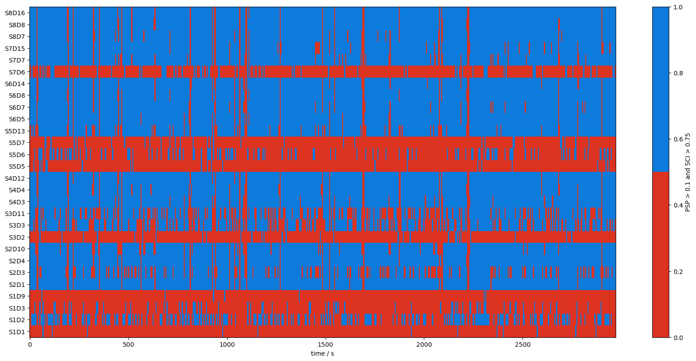
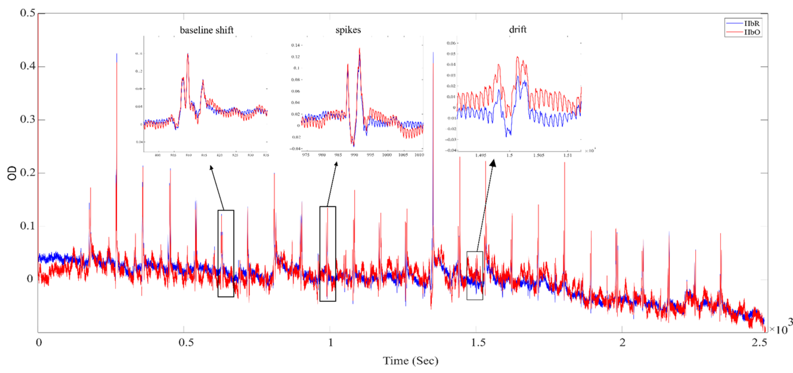
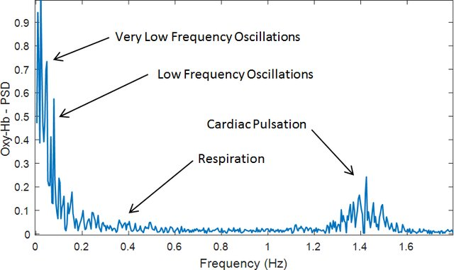
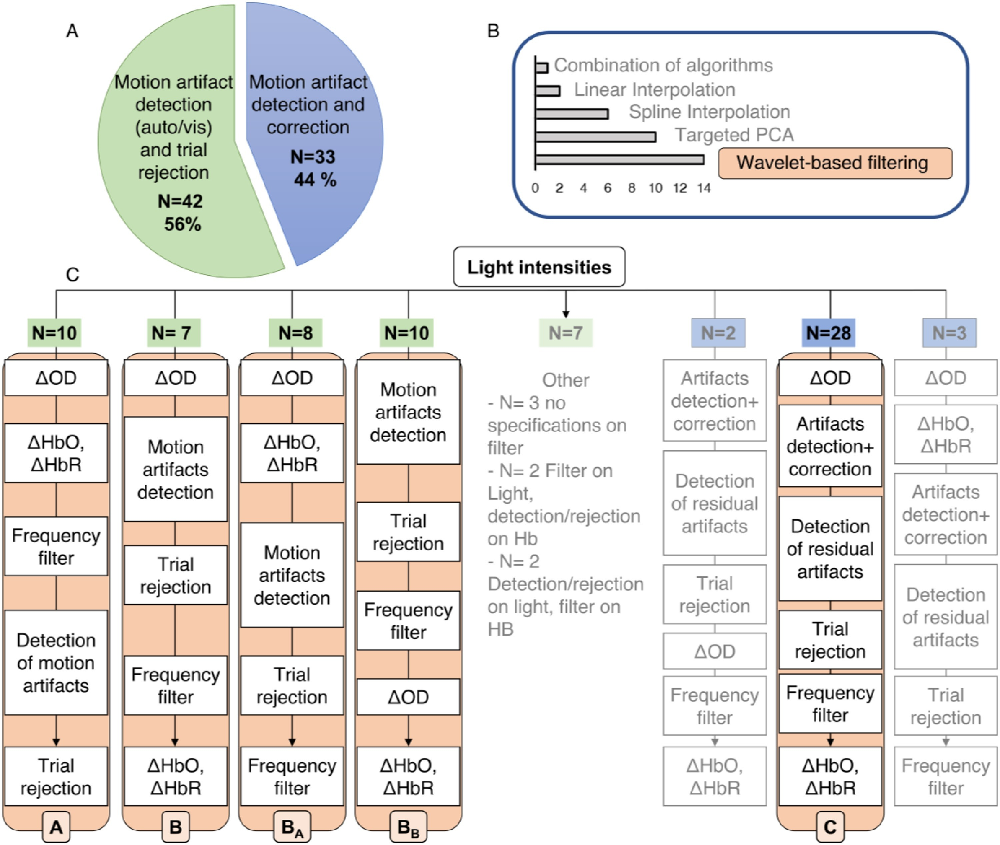
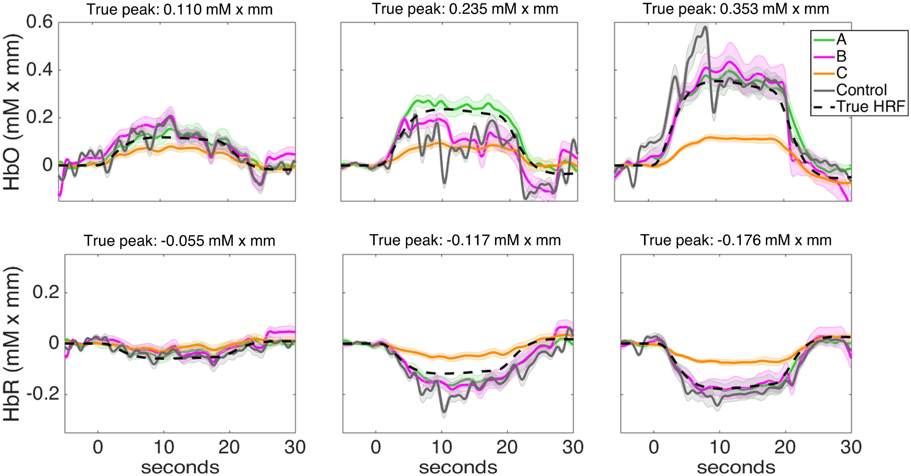

```{python}
# | label: setup
from matplotlib import pyplot as plt
from matplotlib import colors
import numpy as np

from cedalion.dataclasses import Recording

from src import nirs

plt.rcParams["figure.autolayout"] = True

MOP_STIM_MAPPING = {
    "A": [6, 7, 8, 9, 18, 19, 20, 21],
    "B": [10, 11, 12, 13, 22, 23, 24, 25],
    "C": [14, 15, 16, 17, 26, 27, 28, 29],
}

SSP_STIM_MAPPING: dict[str, list[int]] = {
    "A": [9],
    "B": [10],
    "Exclude": [4, 6, 7],
}

CHROMO_COLORS = {760: "tab:blue", 850: "tab:red", "HbR": "tab:blue", "HbO": "tab:red"}
COND_COLORS = {"A": "tab:blue", "B": "tab:orange", "C": "tab:green"}
```

# fNIRS basics

Definitions and formulas from the [fNIRS glossary](https://openfnirs.org/standards/fnirs-glossary-project/) [@stute2025fnirs]:


## Raw light intensity

* Radiant power received by a surface per unit area, due to illumination, or the radiant power received per unit solid angle.

* *Radiant power* is the energy received per unit time. SI units for light intensity are watt per meter squared ($W/m^2$) or watt per steradian ($W/sr$).

## Modified Beer Lambert Law (mBLL)

* Common approach to measuring changes in the tissue absorption using continuous waves methods

* Based on a generalization of Beer-Lambert law

* Assumes that the scattering properties of tissue do not vary with time


## Modified Beer Lambert Law (mBLL)

$$
I=I_0e^{(-\overline{DPF}\mu_ar)-G}
$$

* $I$ is the detected optical intensity
* $I_{0}$ is the incident intensity
* $\overline{DPF}$: is an average (over the absorption range 0- \mu_a) mean pathlength factor that depends on the optical properties of tissue. $\overline{DPF}$ accounts for the dependence of the mean optical pathlength on scattering and absorption
* $r$ is the inter-optode distance
* $G$ is a factor that accounts for the effect of scattering and $\mu_{a}$
* $\mu_a$ is the absorption coefficient. 

## Optical density (OD)

* Characterizes a dissolved chromophore in a non-scattering solution or an optical filter

* (Decadic) logarithm of the ratio of incident to transmitted radiant power through a (non-scattering) sample

Integral form of the mBLL:
$$
A = OD = log_{10}\frac{I_0}{I} = \frac{[\bar{DPF} \mu_a r + G]}{log_e(10)}
$$


## Optical density (OD)

Assuming **$G$ is constant** and that the absorption change in the medium between a baseline condition and a test condition is small compared to $\mu_{a}$:

### Differential form of the mBLL

$$
\Delta A = \Delta {OD} = log_{10}(\frac{I_{baseline}}{I_{test}}) = DPF \frac{ r \Delta \mu_a}{log_e(10)}
$$

### Chromophore concentration

$$
\Delta \mu_a (\lambda) = log _e(10) \cdot [  \epsilon_{HbO_2}(\lambda) \Delta c_{HbO_2} + \epsilon_{Hb}(\lambda) \Delta c_{Hb} ] 
$$

For two different wavelengths (e.g., $\lambda_1=760nm$, $\lambda_2=850nm$):

$$
\Delta A(\lambda_1) = DPF \cdot r \cdot [  \epsilon_{HbO}(\lambda_1) \Delta c_{HbO} + \epsilon_{Hb}(\lambda_1) \Delta c_{HbR} ]  
$$

$$
\Delta A(\lambda_2) = DPF \cdot r \cdot [  \epsilon_{HbO}(\lambda_2) \Delta c_{HbO} + \epsilon_{HbR}(\lambda_2) \Delta c_{HbR} ]
$$

# Before data acquisition

## Task design

We are measuring the **BOLD** signal, which takes around 15 seconds to go back to baseline


## Task design

Add resting periods accordingly in your experimental task


## Montage


## Montage

- Cover the cortical areas of interest
- Keep ~3 cm distance between sources and detectors
    + Standard layout (more distance variability across channels)
    + Custom layout (more difficult to design and handle)
- Short channels?

## Montage

### Brain-scalp (BS) distance

* BS changes across development
* Steady but inhomogeneous (across regions, occipital changes the most), function of brain size
* @beauchamp2011developmental: MRI atlas 0-12 years.
* Left hemisphere smaller than right hemisphere, which leads to a ~2mm BS difference at birth

## Montage

### Source-detector (SD) distance

Appropriate SD distance, roughly calculated as:

$$
\frac{B-S}{2}
$$

In infant studies results in 2-3 cm.

Trade-off between larger distance (more penetration, smaller SNR), and shorter distance (less penetration, bigger SNR).

Make sure penetration index is twice larger than SD of BS distance. Less than 2 is probably too short.

## Montage

### Optode arrangements

Short channels in infants still an open question (scalp thickness very small and inhomogeneous in neonates)

Using an age-appropriate atlas is crucial. Temporal and occipital areas change compared to adults. Some tools:

* **devFOLD**: GitHub - nirx/devfOLD. Earliest age available 2 weeks, only 10-10 system
* **ArrayDesigner**: GitHub - DOT-HUB/ArrayDesigner (Brigadoi et al., 2018). MATLAB app. Up to 10-2.5 system
* **NIRsite**: NIRSite 2.0 | fNIRS Systems | NIRS Devices | NIRx, takes the input form the other two tools to make an arrangement

## Triggers and annotations

Triggers (aka. annotations) are **time points** in the recording marked with a particular **identifier** (a number) that indicate an **event** took place at that time.

- Can be **manually triggered** (e.g., key press by experimenter) or triggered by a **script**
- Critical for precise association between parts of the recorded signal and events of interest during the task

## Triggers and annotations

Different events may get different identifying codes.

For example:

```
1: Task onset (script)
2: Task offset (scrip)
3: Block of condition 1 starts (script)
4: Block of condition 2 starts (script)
5: Parental interference (manual)
6: Movement (manual)
```

## Data organisation: BIDS format

[bids.neuroimaging.io](https://bids.neuroimaging.io)

- Proposed **standard** for **neuroimaging** datasets (EEG, fNIRS, MRI, etc.)
- Adopted and encouraged by the **Society for fNIRS** ([SFNIRS](https://fnirs.org/))
- Increases **reproducibility**, transparency, and documentation
- Ready to share in **BIDS-compliant** repositories (e.g., [OpenNeuro](https://openneuro.org/).)

## Data organisation: BIDS format

Luke, R., Oostenveld, R., Cockx, H., Niso, G., Shader, M. J., Orihuela-Espina, F., ... & Pollonini, L. (2025). NIRS-BIDS: brain imaging data structure extended to near-infrared spectroscopy. Scientific Data, 12(1), 159.


# During data collection

## Aurora

- Good **capping**!
- Ensure an acceptable **calibration**
- **Monitor data quality** during recording: distinguishable hearbeat
- **Annotate unusual activity** in across channels (e.g., saturation, excessive noise, drastic changes in signal)

## Participant data

Some participant info may be of use after data collection:

- **Behaviour** during the task (e.g., sleep state, fussiness)
- **Hair texture** and **skin color**, if possible
    + [Andre Walker Hair Typing System](https://en.wikipedia.org/wiki/Andre_Walker_Hair_Typing_System)
- Take **pictures of cap placement** before and after testing
- **Video** recording?

# Data processing

## General processing steps

1) **Import data as light intensity**
2) **Transform to optical density**
3) **Signal quality assessment** 
4) Channel pruning
5) Motion arctifact correction
6) **Transform to ΔHbO and ΔHbR concentrations**
7) Data filtering (physiological arctifact attenuation)
8) Epoching
9) Averaring 
10) Data analysis

## Signal quality assessment

* Scalp-coupling Index (SCI)
* Peak power
* Global Variance of the Temporal Derivative (GVTD)

## Signal quality assessment



## Channel pruning

Prune problematic channels:

a) Manual upon visual inspection
b) Automatic based on signal quality metrics

## Motion arctifact correction

* Algorithmic approach (e.g., Gervain et al.)
* Temporal Derivative Distribution Repair (TDDR)
* Savitzky–Golay filtering splines

## Motion arctifact correction



## Physiological arctifact attenuation

Attenuate unwanted **physiological arctifacts** (e.g., heartbeat, respiration, high-frequency noise, mayer waves)

| Population | Heartbeat | Respiration | Mayer waves | Very low frequency waves |
|------------|-----------|-------------|-------------|--------------------|
| Adults | 1 Hz | 0.3 Hz | 0.1 Hz | < 0.04 Hz |
| Infants | 1-3 Hz | 0.5-1 Hz | Unknown | Unknown |

## Physiological arctifact attenuation

Attenuate unwanted **physiological arctifacts** (e.g., heartbeat, respiration, high-frequency noise, mayer waves)



## General processing steps

Which ones and in which order?

## Designing a pipeline

Yücel, M. A., Luke, R., Mesquita, R. C., von Lühmann, A., Mehler, D. M., Lührs, M., ... & Zemanek, V. (2025). fNIRS reproducibility varies with data quality, analysis pipelines, and researcher experience. *Communications biology*, 8(1), 1149.

## Designing a pipeline

>[We] asked 38 research teams worldwide to independently analyze the same two fNIRS datasets. Despite using different pipelines, **nearly 80% of teams agreed on group-level results**, particularly when hypotheses were strongly supported by literature. Teams with higher self-reported analysis confidence, which correlated with years of fNIRS experience, showed greater agreement. At the individual level, agreement was lower but improved with better data quality. The **main sources of variability were related to how poor-quality data were handled**, how responses were modeled, and how statistical analyses were conducted.

## Designing a pipeline


## Designing a pipeline


## Designing a pipeline

Gemignani, J., & Gervain, J. (2021). Comparing different pre-processing routines for infant fNIRS data. Developmental cognitive neuroscience, 48, 100943.

## Designing a pipeline



## Designing a pipeline



## Designing a pipeline


## Designing a pipeline

::: incremental
* Data quality/inclusion trade-off needs to be taken into account

* Performance of all pipelines deteriorated with increasing levels of noise, but pipelines A and C were considerably less impacted

* Automatic correction of motion artifacts should be used cautiously, [and] could result in false negatives, reduced effect sizes and an underestimation of the hemodynamic response

* Applying pre-processing to optical densities or concentration changes achieved overall very similar results
:::

## Available toolboxes


## Available toolboxes

### Homer 2/3 (MATLAB)

[https://openfnirs.org/software/homer/homer3/](https://openfnirs.org/software/homer/homer3/)

| Pros                                    | Cons   |
|-----------------------------------------|--------|
| Most adopted by fNIRS researchers       | MATLAB |
| Good documentation                      |        |
| Well mantained                          |        |
| Implements many functions and pipelines |        |

## Available toolboxes

### MNE (Python)

[https://mne.tools/stable/index.html](https://mne.tools/stable/index.html)

| Pros                         | Cons                                   |
|------------------------------|----------------------------------------|
| Free, open source            | Python                                 |
| Good EEG, MRI integration    | Less used                              |
| Well mantained               | Montage co-registration is challenging |
| Helpful and active community |                                        |

## Available toolboxes

### Cedalion (Python)

[http://cedalion.tools/](http://cedalion.tools/)

| Pros                             | Cons           |
|----------------------------------|----------------|
| Free, open source                | Python         |
| fNIRS-specific                   | fNIRS-specific |
| Seamless montage co-registration | In development |
| Possible successor of Homer      |                |

## Available toolboxes

### Others

- [OxySoft (Artinis)](https://www.artinis.com/oxysoft)
- [NIRSTORM](https://github.com/Nirstorm/nirstorm)
- [Fieldtrip](https://www.fieldtriptoolbox.org/)
- [AnalyzIR](https://github.com/huppertt/nirs-toolbox)

## Importing the data

```{python}
# | label: import-data
# | echo: false
from pathlib import Path

from cedalion import io

file = Path("data/ssp-good.snirf")
rec = io.read_snirf(file)[0]
rec.stim = nirs.process_events(rec.stim, MOP_STIM_MAPPING)
rec["amp"] = rec["amp"].pint.dequantify().pint.quantify("V")
```

```python
from pathlib import Path

from cedalion import io

file = Path("data/mop-cap.snirf")
rec = io.read_snirf(file)[0]
rec["amp"] = rec["amp"].pint.dequantify().pint.quantify("V")
```

## Raw light intensity

```{python}
# | label: fig-raw
# | fig-width: 10
# | fig-height: 6
def get_units(x: Recording):
    try:
        if x.pint.units == "volt":
            return "V"
        if x.pint.units == "uM":
            return "µM/L"
        raise UnboundLocalError
    except UnboundLocalError:
        return


def plot_all_channels(x: Recording):
    is_chromo = "chromo" in x.coords
    series = x.chromo if is_chromo else x.wavelength

    units = get_units(x)

    fig, axes = plt.subplots(2, 1)
    for s, ax in zip(series.data, axes):
        for ch in x.channel:
            y = (
                x.sel(channel=ch, chromo=s)
                if is_chromo
                else x.sel(channel=ch, wavelength=s)
            )
            ax.plot(x.time, y, lw=3 / 4, c=CHROMO_COLORS[s], alpha=1 / 2)
        ax.set_title(f"Δ{s}" if is_chromo else f"{s:n} nm")
        ax.set_ylabel(units)

    return axes


def plot_channel(x: Recording):
    is_chromo = "chromo" in x.coords
    series = x.chromo if is_chromo else x.wavelength
    units = get_units(x)

    fig, axes = plt.subplots(2, 1)
    for s, ax in zip(series.data, axes):
        y = x.sel(chromo=s) if is_chromo else x.sel(wavelength=s)
        ax.plot(x.time, y, lw=3 / 4, c=CHROMO_COLORS[s])
        ax.set_title(f"Δ{s}" if is_chromo else f"{s:n} nm")
        ax.set_ylabel(units)

    return axes


x = rec["amp"]

plot_all_channels(x)
```


## Raw light intensity

```{python}
# | label: fig-raw-s1d1
# | fig-width: 10
# | fig-height: 6
channel = "S1D1"
plot_channel(x.sel(channel=channel))
```

## Raw light intensity

```{python}
# | label: fig-raw-s1d1-zoom
# | fig-width: 10
# | fig-height: 6
times = 200, 260
x_zoom = x.sel(time=slice(*times), channel=channel)
plot_channel(x_zoom)
```


## Raw light intensity

```{python}
# | label: fig-raw-s7d7
# | fig-width: 10
# | fig-height: 6
channel = "S7D7"
plot_channel(x.sel(channel=channel))
```

## Raw light intensity

```{python}
# | label: fig-raw-s7d7-zoom
# | fig-width: 10
# | fig-height: 6
times = 200, 260
x_zoom = x.sel(time=slice(*times), channel=channel)
plot_channel(x_zoom)
```

## Raw light intensity

```{python}
# | label: amp-mask
# | echo: true
from cedalion import units
from cedalion.sigproc import quality

_, amp_mask = quality.mean_amp(rec["amp"], (0.0, 2.0) * units.V)
```

```{python}
# | label: fig-raw-amp-mask
# | fig-width: 10
# | fig-height: 6
fig, axes = plt.subplots(1, 2, sharey=True)

for i_wl, wl in enumerate((760, 850)):
    axes[i_wl].scatter(
        amp_mask.sel(wavelength=wl),
        amp_mask.channel,
        c=["green" if a else "red" for a in amp_mask.sel(wavelength=wl)],
    )
    axes[i_wl].set_title(str(wl) + " nm")

fig.legend()
```

## Optical density

```{python}
# | label: sci
# | echo: true
from cedalion.nirs.cw import int2od, od2conc

rec["od"] = int2od(rec["amp"])  # intensity to optical density (OD)
```

```{python}
# | label: fig-od
# | fig-width: 10
# | fig-height: 6
x = rec["od"]
plot_all_channels(x)
```

## Optical density

```{python}
# | label: fig-od-s1d1
# | fig-width: 10
# | fig-height: 6
channel = "S1D1"
x_zoom = x.sel(channel=channel)
plot_channel(x_zoom)
```

## Optical density

```{python}
# | label: fig-od-s1d1-zoom
# | fig-width: 10
# | fig-height: 6
times = 200, 260
x_zoom = x.sel(time=slice(*times), channel=channel)
plot_channel(x_zoom)
```

## Optical density

```{python}
# | label: fig-od-s7d7
# | fig-width: 10
# | fig-height: 6
channel = "S7D7"
x_zoom = x.sel(channel=channel)
plot_channel(x_zoom)
```

## Optical density

```{python}
# | label: fig-od-s7d7-zoom
# | fig-width: 10
# | fig-height: 6
times = 200, 260
x_zoom = x.sel(time=slice(*times), channel=channel)
plot_channel(x_zoom)
```


## Scalp Coupling Index (SCI)

```{python}
# | label: sci-plot
# | echo: true
sci, sci_mask = quality.sci(
    rec["od"],
    5.0 * units.s,  # window length
    0.90,  # SCI threshold
    cardiac_fmin=1.17 * units.Hz,
    cardiac_fmax=3.17 * units.Hz,
)
```


## Data quality checks

```{python}
# | label: fig-sci
cmap = colors.ListedColormap(["tab:red", "white"])
fig, axes = plt.subplots(2, 1)
axes[0].imshow(sci, aspect="auto", cmap="Greys_r")
axes[1].imshow(sci_mask, aspect="auto", cmap=cmap)
```

## Motion arctifact identification

```{python}
# | label: ma-mask
# | echo: true
ma_mask = quality.id_motion(rec["od"], 1 * units.s, 1.0 * units.s, 15, 0.5)
ma_mask, _ = quality.id_motion_refine(ma_mask, "by_channel")
```

```{python}
# | label: fig-ma
fig, axes = plt.subplots(1, 1)
axes.imshow(ma_mask, aspect="auto", cmap="Greys_r")
```

## Motion arctifact detection

```{python}
# | label: fig-ma-s1d1
channel = "S1D1"
fig, ax = plt.subplots(1, 1)
dax = ax.twiny()
ax.plot(x.time, x.sel(channel=channel, wavelength=760), c="tab:blue")
ax.plot(x.time, x.sel(channel=channel, wavelength=850), c="tab:red")
xmin = x.sel(channel=channel, wavelength=850).min()
xmax = x.sel(channel=channel, wavelength=850).max()
dax.plot((ma_mask.sel(channel=channel) * (xmax - xmin)) + xmin, c="k", alpha=1 / 4)
```

## Motion arctifact detection

```{python}
# | label: fig-ma-s1d1-zoom
times = 410, 445
channel = "S1D1"
fig, axes = plt.subplots(2, 1, sharey=False)

x_zoom = x.sel(channel=channel, time=slice(*times))
axes[0].plot(x_zoom.time, x_zoom.sel(wavelength=760), c="tab:blue")
axes[0].plot(x_zoom.time, x_zoom.sel(wavelength=850), c="tab:red")

ma = ma_mask.sel(channel=channel, time=slice(*times))
axes[1].plot(ma.time, ma, c="k")  
```

## Motion arctifact detection

```{python}
# | label: fig-ma-s7d7-zoom
times = 410, 445
channel = "S7D7"
fig, axes = plt.subplots(2, 1, sharey=False)

x_zoom = x.sel(channel=channel, time=slice(*times))
axes[0].plot(x_zoom.time, x_zoom.sel(wavelength=760), c="tab:blue")
axes[0].plot(x_zoom.time, x_zoom.sel(wavelength=850), c="tab:red")

ma = ma_mask.sel(channel=channel, time=slice(*times))
axes[1].plot(ma.time, ma, c="k")
```

## Motion arctifact detection

```{python}
# | label: fig-ma-s7d7-zoom-2
times = 170, 260
channel = "S7D7"
fig, axes = plt.subplots(2, 1, sharey=False)

x_zoom = x.sel(channel=channel, time=slice(*times))
axes[0].plot(x_zoom.time, x_zoom.sel(wavelength=760), c="tab:blue")
axes[0].plot(x_zoom.time, x_zoom.sel(wavelength=850), c="tab:red")

ma = ma_mask.sel(channel=channel, time=slice(*times))
axes[1].plot(ma.time, ma, c="k") 
```

## Motion arctifact correction

### Temporal Derivative Distribution Repair (TDDR)

```{python}
# | label: tddr
# | echo: true
from cedalion.sigproc import motion_correct

rec["od_tddr"] = motion_correct.tddr(rec["od"])
```

```{python}
# | label: fig-motion-tddr
# | fig-width: 10
# | fig-height: 6
x = rec["od_tddr"]

fig, axes = plt.subplots(2, 2, sharey=True)
for i_wl, (wl, color) in enumerate(zip((760, 850), ("tab:blue", "tab:red"))):
    for ch in x.channel.data:
        axes[0, i_wl].plot(
            rec["od"].time,
            rec["od"].sel(channel=ch, wavelength=wl),
            lw=3 / 4,
            c=color,
            alpha=1 / 2,
        )
        axes[1, i_wl].plot(
            x.time, x.sel(channel=ch, wavelength=wl), lw=3 / 4, c=color, alpha=1 / 2
        )
```


## Motion arctifact correction

### Temporal Derivative Distribution Repair (TDDR)

```{python}
# | label: fig-motion-tddr-s1d1
# | fig-width: 10
# | fig-height: 6
channel = "S1D1"
x_zoom = x.sel(channel=channel)
ma = ma_mask.sel(channel=channel)

fig, axes = plt.subplots(2, 2)
for i_wl, (wl, color) in enumerate(zip((760, 850), ("tab:blue", "tab:red"))):
    axes[0, i_wl].plot(
        rec["od"].sel(channel=channel).time,
        rec["od"].sel(channel=ch, wavelength=wl),
        lw=3 / 4,
        c="grey",
        alpha=1 / 2,
    )
    axes[0, i_wl].plot(x_zoom.time, x_zoom.sel(wavelength=wl), lw=3 / 4, c=color)
    axes[1, i_wl].plot(ma.time, ma, c="k") 
```

## Motion arctifact correction

### Temporal Derivative Distribution Repair (TDDR)

```{python}
# | label: fig-motion-tddr-s1d1-zoom
# | fig-width: 10
# | fig-height: 6
channel = "S1D1"
times = 410, 445
x_zoom = x.sel(channel=channel, time=slice(*times))
ma = ma_mask.sel(channel=channel, time=slice(*times))

fig, axes = plt.subplots(2, 2)
for i_wl, (wl, color) in enumerate(zip((760, 850), ("tab:blue", "tab:red"))):
    axes[0, i_wl].plot(
        rec["od"].sel(time=slice(*times)).time,
        rec["od"].sel(channel=ch, wavelength=wl, time=slice(*times)),
        lw=3 / 4,
        c="grey",
        alpha=1 / 2,
    )
    axes[0, i_wl].plot(x_zoom.time, x_zoom.sel(wavelength=wl), lw=3 / 4, c=color)
    axes[1, i_wl].plot(ma.time, ma, c="k") 
```

## Motion arctifact correction

### Temporal Derivative Distribution Repair (TDDR)

```{python}
# | label: fig-motion-tddr-s7d7
# | fig-width: 10
# | fig-height: 6
channel = "S7D7"
x_zoom = x.sel(channel=channel)
ma = ma_mask.sel(channel=channel)

fig, axes = plt.subplots(2, 2)
for i_wl, (wl, color) in enumerate(zip((760, 850), ("tab:blue", "tab:red"))):
    axes[0, i_wl].plot(
        rec["od"].sel(channel=channel).time,
        rec["od"].sel(channel=ch, wavelength=wl),
        lw=3 / 4,
        c="grey",
        alpha=1 / 2,
    )
    axes[0, i_wl].plot(x_zoom.time, x_zoom.sel(wavelength=wl), lw=3 / 4, c=color)
    axes[1, i_wl].plot(ma.time, ma, c="k") 
```

## Motion arctifact correction

### Temporal Derivative Distribution Repair (TDDR)

```{python}
# | label: fig-motion-tddr-s7d7-zoom
# | fig-width: 10
# | fig-height: 6
channel = "S7D7"
times = 170, 260
x_zoom = x.sel(channel=channel, time=slice(*times))
ma = ma_mask.sel(channel=channel, time=slice(*times))

fig, axes = plt.subplots(2, 2)
for i_wl, (wl, color) in enumerate(zip((760, 850), ("tab:blue", "tab:red"))):
    axes[0, i_wl].plot(
        rec["od"].sel(time=slice(*times)).time,
        rec["od"].sel(channel=ch, wavelength=wl, time=slice(*times)),
        lw=3 / 4,
        c="grey",
        alpha=1 / 2,
    )
    axes[0, i_wl].plot(x_zoom.time, x_zoom.sel(wavelength=wl), lw=3 / 4, c=color)
    axes[1, i_wl].plot(ma.time, ma, c="k") 
```

## Motion arctifact correction

### Wavelet

```{python}
# | label: wavelet
# | echo: true
rec["od_wavelet"] = motion_correct.wavelet(rec["od"], iqr=1)
```

```{python}
# | label: fig-motion-wavelet
# | fig-width: 10
# | fig-height: 6
x = rec["od_wavelet"]

fig, axes = plt.subplots(2, 2, sharey=True)
for i_wl, (wl, color) in enumerate(zip((760, 850), ("tab:blue", "tab:red"))):
    for ch in x.channel.data:
        axes[0, i_wl].plot(
            rec["od"].time,
            rec["od"].sel(channel=ch, wavelength=wl),
            lw=3 / 4,
            c=color,
            alpha=1 / 2,
        )
        axes[1, i_wl].plot(
            x.time, x.sel(channel=ch, wavelength=wl), lw=3 / 4, c=color, alpha=1 / 2
        )
```


## Motion arctifact correction

### Wavelet

```{python}
# | label: fig-motion-wavelet-s1d1
# | fig-width: 10
# | fig-height: 6
channel = "S1D1"
x_zoom = x.sel(channel=channel)
ma = ma_mask.sel(channel=channel)

fig, axes = plt.subplots(2, 2)
for i_wl, (wl, color) in enumerate(zip((760, 850), ("tab:blue", "tab:red"))):
    axes[0, i_wl].plot(
        rec["od"].sel(channel=channel).time,
        rec["od"].sel(channel=ch, wavelength=wl),
        lw=3 / 4,
        c="grey",
        alpha=1 / 2,
    )
    axes[0, i_wl].plot(x_zoom.time, x_zoom.sel(wavelength=wl), lw=3 / 4, c=color)
    axes[1, i_wl].plot(ma.time, ma, c="k") 
```

## Motion arctifact correction

### Wavelet

```{python}
# | label: fig-motion-wavelet-s1d1-zoom
# | fig-width: 10
# | fig-height: 6
channel = "S1D1"
times = 410, 445
x_zoom = x.sel(channel=channel, time=slice(*times))
ma = ma_mask.sel(channel=channel, time=slice(*times))

fig, axes = plt.subplots(2, 2)
for i_wl, (wl, color) in enumerate(zip((760, 850), ("tab:blue", "tab:red"))):
    axes[0, i_wl].plot(
        rec["od"].sel(time=slice(*times)).time,
        rec["od"].sel(channel=ch, wavelength=wl, time=slice(*times)),
        lw=3 / 4,
        c="grey",
        alpha=1 / 2,
    )
    axes[0, i_wl].plot(x_zoom.time, x_zoom.sel(wavelength=wl), lw=3 / 4, c=color)
    axes[1, i_wl].plot(ma.time, ma, c="k") 
```

## Motion arctifact correction

### Wavelet

```{python}
# | label: fig-motion-wavelet-s7d7
# | fig-width: 10
# | fig-height: 6
channel = "S7D7"
x_zoom = x.sel(channel=channel)
ma = ma_mask.sel(channel=channel)

fig, axes = plt.subplots(2, 2)
for i_wl, (wl, color) in enumerate(zip((760, 850), ("tab:blue", "tab:red"))):
    axes[0, i_wl].plot(
        rec["od"].sel(channel=channel).time,
        rec["od"].sel(channel=ch, wavelength=wl),
        lw=3 / 4,
        c="grey",
        alpha=1 / 2,
    )
    axes[0, i_wl].plot(x_zoom.time, x_zoom.sel(wavelength=wl), lw=3 / 4, c=color)
    axes[1, i_wl].plot(ma.time, ma, c="k") 
```

## Motion arctifact correction

### Wavelet

```{python}
# | label: fig-motion-wavelet-s7d7-zoom
# | fig-width: 10
# | fig-height: 6
channel = "S7D7"
times = 170, 260
x_zoom = x.sel(channel=channel, time=slice(*times))
ma = ma_mask.sel(channel=channel, time=slice(*times))

fig, axes = plt.subplots(2, 2)
for i_wl, (wl, color) in enumerate(zip((760, 850), ("tab:blue", "tab:red"))):
    axes[0, i_wl].plot(
        rec["od"].sel(time=slice(*times)).time,
        rec["od"].sel(channel=ch, wavelength=wl, time=slice(*times)),
        lw=3 / 4,
        c="grey",
        alpha=1 / 2,
    )
    axes[0, i_wl].plot(x_zoom.time, x_zoom.sel(wavelength=wl), lw=3 / 4, c=color)
    axes[1, i_wl].plot(ma.time, ma, c="k") 
```


## Motion arctifact correction

### Spline interpolation

```{python}
# | label: spline
# | echo: true
rec["od_spline"] = motion_correct.spline_sg(rec["od"], p=1)
```

```{python}
# | label: fig-motion-spline
# | fig-width: 10
# | fig-height: 6
x = rec["od_spline"]

fig, axes = plt.subplots(2, 2, sharey=True)
for i_wl, (wl, color) in enumerate(zip((760, 850), ("tab:blue", "tab:red"))):
    for ch in x.channel.data:
        axes[0, i_wl].plot(
            rec["od"].time,
            rec["od"].sel(channel=ch, wavelength=wl),
            lw=3 / 4,
            c=color,
            alpha=1 / 2,
        )
        axes[1, i_wl].plot(
            x.time, x.sel(channel=ch, wavelength=wl), lw=3 / 4, c=color, alpha=1 / 2
        )
```


## Motion arctifact correction

### Spline interpolation

```{python}
# | label: fig-motion-spline-s1d1
# | fig-width: 10
# | fig-height: 6
channel = "S1D1"
x_zoom = x.sel(channel=channel)
ma = ma_mask.sel(channel=channel)

fig, axes = plt.subplots(2, 2)
for i_wl, (wl, color) in enumerate(zip((760, 850), ("tab:blue", "tab:red"))):
    axes[0, i_wl].plot(
        rec["od"].sel(channel=channel).time,
        rec["od"].sel(channel=ch, wavelength=wl),
        lw=3 / 4,
        c="grey",
        alpha=1 / 2,
    )
    axes[0, i_wl].plot(x_zoom.time, x_zoom.sel(wavelength=wl), lw=3 / 4, c=color)
    axes[1, i_wl].plot(ma.time, ma, c="k") 
```

## Motion arctifact correction

### Spline interpolation

```{python}
# | label: fig-motion-spline-s1d1-zoom
# | fig-width: 10
# | fig-height: 6
channel = "S1D1"
times = 410, 445
x_zoom = x.sel(channel=channel, time=slice(*times))
ma = ma_mask.sel(channel=channel, time=slice(*times))

fig, axes = plt.subplots(2, 2)
for i_wl, (wl, color) in enumerate(zip((760, 850), ("tab:blue", "tab:red"))):
    axes[0, i_wl].plot(
        rec["od"].sel(time=slice(*times)).time,
        rec["od"].sel(channel=ch, wavelength=wl, time=slice(*times)),
        lw=3 / 4,
        c="grey",
        alpha=1 / 2,
    )
    axes[0, i_wl].plot(x_zoom.time, x_zoom.sel(wavelength=wl), lw=3 / 4, c=color)
    axes[1, i_wl].plot(ma.time, ma, c="k") 
```

## Motion arctifact correction

### Spline interpolation

```{python}
# | label: fig-motion-spline-s7d7
# | fig-width: 10
# | fig-height: 6
channel = "S7D7"
x_zoom = x.sel(channel=channel)
ma = ma_mask.sel(channel=channel)

fig, axes = plt.subplots(2, 2)
for i_wl, (wl, color) in enumerate(zip((760, 850), ("tab:blue", "tab:red"))):
    axes[0, i_wl].plot(
        rec["od"].sel(channel=channel).time,
        rec["od"].sel(channel=ch, wavelength=wl),
        lw=3 / 4,
        c="grey",
        alpha=1 / 2,
    )
    axes[0, i_wl].plot(x_zoom.time, x_zoom.sel(wavelength=wl), lw=3 / 4, c=color)
    axes[1, i_wl].plot(ma.time, ma, c="k") 
```

## Motion arctifact correction

### Spline interpolation

```{python}
# | label: fig-motion-spline-s7d7-zoom
# | fig-width: 10
# | fig-height: 6
channel = "S7D7"
times = 170, 260
x_zoom = x.sel(channel=channel, time=slice(*times))
ma = ma_mask.sel(channel=channel, time=slice(*times))

fig, axes = plt.subplots(2, 2)
for i_wl, (wl, color) in enumerate(zip((760, 850), ("tab:blue", "tab:red"))):
    axes[0, i_wl].plot(
        rec["od"].sel(time=slice(*times)).time,
        rec["od"].sel(channel=ch, wavelength=wl, time=slice(*times)),
        lw=3 / 4,
        c="grey",
        alpha=1 / 2,
    )
    axes[0, i_wl].plot(x_zoom.time, x_zoom.sel(wavelength=wl), lw=3 / 4, c=color)
    axes[1, i_wl].plot(ma.time, ma, c="k") 
```

## Channel pruning

```{python}
# | label: masks
# | echo: true
all_masks = sci_mask & amp_mask & ma_mask
rec.set_mask("mask", all_masks)
time_clean = all_masks.sum(dim="time") / len(sci.time)
quality_masks = [time_clean >= 0.50]
```

```{python}
# | label: fig-all-masks
fig, axes = plt.subplots(1, 1)
axes.imshow(all_masks.sel(wavelength=760), aspect="auto", cmap="Greys_r")
```

```{python}
# | label: fig-all-masks-time
from cedalion.vis.anatomy import scalp_plot

# plot the percentage of clean time per channel
fig, ax = plt.subplots(1, 1, figsize=(8, 8))

scalp_plot(
    rec["od_tddr"].sel(wavelength=760),
    rec.geo3d,
    time_clean.sel(wavelength=760),
    ax,
    cmap="RdYlGn",
    vmin=0,
    vmax=1,
    title=None,
    cb_label="Percentage of clean time",
    channel_lw=2,
)

fig.tight_layout()
```

## Channel pruning

```{python}
# | label: prune-channels
# | echo: true
rec["od"], exc_channels = quality.prune_ch(rec["od"], quality_masks, "all")
print(exc_channels)
```

## Chromophore relative concentrations: ΔHBO and ΔHBR

```{python}
# | label: beer-lambert
# | echo: true
import xarray as xr

dpf_values = [4.2, 5.3]
dpf = xr.DataArray(
    dpf_values, dims="wavelength", coords={"wavelength": rec["od"].wavelength}
)
rec["conc"] = od2conc(rec["od_spline"], rec.geo3d, dpf)
```

## Chromophore relative concentrations: ΔHBO and ΔHBR

```{python}
# | label: fig-conc
# | fig-width: 10
# | fig-height: 6
x = rec["conc"]

fig, axes = plt.subplots(2, 1)
for chromo, ax, color in zip(("HbR", "HbO"), axes, ("tab:blue", "tab:red")):
    for ch in x.channel.data:
        ax.plot(
            x.time, x.sel(channel=ch, chromo=chromo), lw=3 / 4, c=color, alpha=1 / 2
        )
```

## Chromophore relative concentrations: ΔHBO and ΔHBR

```{python}
# | label: fig-conc-s1d1
# | fig-width: 10
# | fig-height: 6
channel = "S1D1"
x_zoom = x.sel(channel=channel)

fig, axes = plt.subplots(1, 1)
for chromo, color in zip(("HbR", "HbO"), ("tab:blue", "tab:red")):
    axes.plot(
        x_zoom.time, x_zoom.sel(chromo=chromo), lw=3 / 4, c=color, label="Δ" + chromo
    )
axes.set_title(channel)
fig.legend()
```


## Chromophore relative concentrations: ΔHBO and ΔHBR

```{python}
# | label: fig-conc-s1d1-zoom
# | fig-width: 10
# | fig-height: 6
channel = "S1D1"
times = 180, 240
x_zoom = x.sel(channel=channel, time=slice(*times))

fig, axes = plt.subplots(1, 1)
for chromo, color in zip(("HbR", "HbO"), ("tab:blue", "tab:red")):
    axes.plot(
        x_zoom.time, x_zoom.sel(chromo=chromo), lw=3 / 4, c=color, label="Δ" + chromo
    )
axes.set_title(channel)
fig.legend()
```

## Chromophore relative concentrations: ΔHBO and ΔHBR

```{python}
# | label: fig-conc-s7d7
# | fig-width: 10
# | fig-height: 6
channel = "S7D7"
x_zoom = x.sel(channel=channel)

fig, axes = plt.subplots(1, 1)
for chromo, color in zip(("HbR", "HbO"), ("tab:blue", "tab:red")):
    axes.plot(
        x_zoom.time, x_zoom.sel(chromo=chromo), lw=3 / 4, c=color, label="Δ" + chromo
    )
axes.set_title(channel)
fig.legend()
```

## Chromophore relative concentrations: ΔHBO and ΔHBR

```{python}
# | label: fig-conc-s7d7-zoom
# | fig-width: 10
# | fig-height: 6
channel = "S7D7"
times = 180, 240
x_zoom = x.sel(channel=channel, time=slice(*times))

fig, axes = plt.subplots(1, 1)
for chromo, color in zip(("HbR", "HbO"), ("tab:blue", "tab:red")):
    axes.plot(
        x_zoom.time, x_zoom.sel(chromo=chromo), lw=3 / 4, c=color, label="Δ" + chromo
    )
axes.set_title(channel)
fig.legend()
```

## Filtering out physiological arctifacts

* High-pass filter
* Band-pass filter

## Filtering out physiological arctifacts

```{python}
# | label: band-pass-filter
# | echo: true
fmin, fmax = 0.01, 1.0
rec["conc_filt"] = rec["conc"].cd.freq_filter(
    fmin=fmin * units.Hz, fmax=fmax * units.Hz
)
```


## Filtering out physiological arctifacts
```{python}
# | label: fig-conc-filt
# | fig-width: 10
# | fig-height: 6
x = rec["conc_filt"]

fig, axes = plt.subplots(2, 1)
for chromo, ax, color in zip(("HbR", "HbO"), axes, ("tab:blue", "tab:red")):
    for ch in x.channel.data:
        ax.plot(
            x.time, x.sel(channel=ch, chromo=chromo), lw=3 / 4, c=color, alpha=1 / 2
        )
```

## Filtering out physiological arctifacts

```{python}
# | label: fig-conc-s1d1-filt
# | fig-width: 10
# | fig-height: 6
channel = "S1D1"
times = 180, 240
x_zoom = x.sel(channel=channel, time=slice(*times))

fig, axes = plt.subplots(2, 1)
for chromo, color in zip(("HbR", "HbO"), ("tab:blue", "tab:red")):
    axes[0].plot(
        rec["conc"].sel(channel=channel, time=slice(*times)).time,
        rec["conc"].sel(channel=channel, time=slice(*times), chromo=chromo),
        lw=3 / 4,
        c=color,
        label="Δ" + chromo,
    )
    axes[0].set_title(channel)
    axes[1].plot(
        x_zoom.time, x_zoom.sel(chromo=chromo), lw=3 / 4, c=color, label="Δ" + chromo
    )
    axes[1].set_title(channel)
fig.legend()
```

## Filtering out physiological arctifacts

```{python}
# | label: fig-conc-s7d7-filt
# | fig-width: 10
# | fig-height: 6
channel = "S7D7"
times = 180, 240
x_zoom = x.sel(channel=channel, time=slice(*times))

fig, axes = plt.subplots(2, 1)
for chromo, color in zip(("HbR", "HbO"), ("tab:blue", "tab:red")):
    axes[0].plot(
        rec["conc"].sel(channel=channel, time=slice(*times)).time,
        rec["conc"].sel(channel=channel, time=slice(*times), chromo=chromo),
        lw=3 / 4,
        c=color,
        label="Δ" + chromo,
    )
    axes[0].set_title(channel)
    axes[1].plot(
        x_zoom.time, x_zoom.sel(chromo=chromo), lw=3 / 4, c=color, label="Δ" + chromo
    )
    axes[1].set_title(channel)

fig.legend()
```


# Statistical analysis

## Epoching and averaging

```{python}
# | label: stim
# | echo: true
print(rec.stim)
```

## Epoching and averaging

```{python}
# | label: fig-stim
# | fig-width: 10
# | fig-height: 6
fig, axes = plt.subplots(2, 1)
for chromo, ax, color in zip(("HbR", "HbO"), axes, ("tab:blue", "tab:red")):
    for row in rec.stim.itertuples():
        ax.axvline(row.onset, color=COND_COLORS[row.trial_type])
    for ch in x.channel.data:
        ax.plot(
            x.time, x.sel(channel=ch, chromo=chromo), lw=3 / 4, c=color, alpha=1 / 2
        )
```

## Epoching and averaging

```{python}
# | label: fig-epochs
# | fig-width: 10
# | fig-height: 6
channels = ["S1D1", "S7D7", "S4D3"]
times = 180, 300

fig, axes = plt.subplots(len(channels), 1)
for ch, ax in zip(channels, axes.flatten()):
    x_zoom = x.sel(channel=ch, time=slice(*times))
    for chromo, color in zip(("HbR", "HbO"), ("tab:blue", "tab:red")):
        for row in rec.stim.itertuples():
            if row.onset > times[0] and times[1] > row.onset:
                ax.axvline(row.onset, color=COND_COLORS[row.trial_type])
        ax.plot(
            x_zoom.time,
            x_zoom.sel(chromo=chromo),
            lw=1,
            c=color,
            label="Δ" + chromo,
        )
        ax.set_title(ch)
```

## Epoching and averaging

```{python}
# | label: epochs
# | echo: true
tmin, tmax = -5 * units.s, 57.4 * units.s
epochs = rec["conc_filt"].cd.to_epochs(
    rec.stim, ["A", "B"], before=abs(tmin), after=tmax
)
baseline = epochs.sel(reltime=(epochs.reltime < 0)).mean("reltime")
rec["epochs"] = epochs - baseline
```

## Epoching and averaging

```{python}
# | label: fig-epochs-s1d1
fig, axes = plt.subplots(2, 3)
grouped_epochs = epochs.groupby("trial_type")
channel = "S1D1"
for i_trial, trial_type in enumerate(["A", "B"]):
    for epoch in grouped_epochs[trial_type]:
        for i_chromo, (chromo, color) in enumerate(
            zip(epochs.chromo.data, ("tab:red", "tab:blue"))
        ):
            ax = axes[i_chromo, i_trial]
            ax.plot(
                epoch.reltime,
                epoch.sel(chromo=chromo, channel=channel),
                c=color,
                alpha=1 / 2,
            )
            ax.set_title(f"{trial_type[0]} - {chromo}")
```

## Epoching and averaging

```{python}
# | label: fig-epochs-all-s7d7
fig, axes = plt.subplots(2, 3)
grouped_epochs = epochs.groupby("trial_type")
channel = "S7D7"
for i_trial, trial_type in enumerate(["A", "B"]):
    for epoch in grouped_epochs[trial_type]:
        for i_chromo, (chromo, color) in enumerate(
            zip(epochs.chromo.data, ("tab:red", "tab:blue"))
        ):
            ax = axes[i_chromo, i_trial]
            ax.plot(
                epoch.reltime,
                epoch.sel(chromo=chromo, channel=channel),
                c=color,
                alpha=1 / 2,
            )
            ax.set_title(f"{trial_type[0]} - {chromo}")
```

## Epoching and averaging

```{python}
# | label: averaging
# | echo: true
# average blocks from the same trial type
rec["avg_epochs"] = epochs.groupby("trial_type").mean("epoch")
```


```{python}
# | label: fig-epochs-avg-s1d1
fig, axes = plt.subplots(2, 3)
channel = "S1D1"
avg_epochs = rec["avg_epochs"]
for i_trial, trial_type in enumerate(["A", "B"]):
    for i_chromo, (chromo, color) in enumerate(
        zip(avg_epochs.chromo.data, ("tab:red", "tab:blue"))
    ):
        d = avg_epochs.sel(chromo=chromo, channel=channel, trial_type=trial_type)
        ax = axes[i_chromo, i_trial]
        ax.plot(avg_epochs.reltime, d, c=color)
        ax.set_title(f"{trial_type[0]} - {chromo}")
```

